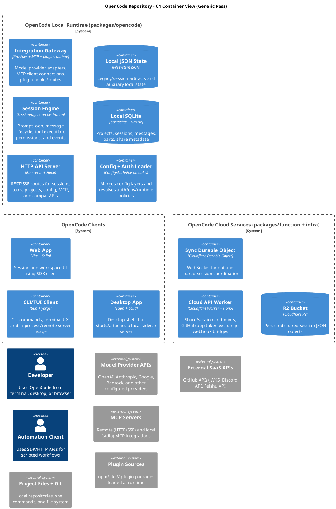
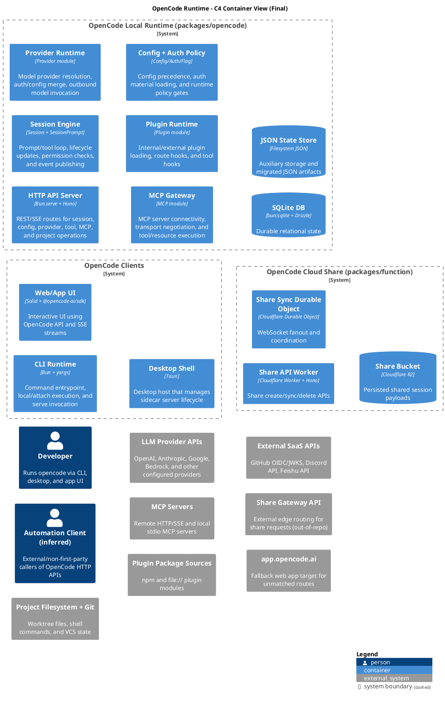

# Prompt: Write "Prompting Techniques That Actually Work"

You are writing a technical article titled **"Prompting Techniques That Actually Work: Lessons from Automating Architecture Analysis"**.

**Audience:** Junior to senior software developers.
**Tone:** Approachable, narrative-driven, technically precise. Not academic — practical and opinionated.
**Length:** 800-1200 lines of markdown. This is a full article, not a cheat sheet.

---

## What this article is about

We used AI to produce C4 architecture diagrams for a real open-source codebase (OpenCode — a CLI/desktop/web AI coding assistant). We started with a naive prompt and got mediocre results. Over 5 iterations, we systematically improved our prompts using specific techniques until we got excellent, evidence-backed, reviewer-approved outputs. This article teaches those techniques through that story.

---

## Structure the article as a narrative with these sections

### 1. Introduction

Why prompt quality matters for non-trivial tasks. Set up the problem: "We wanted AI to produce accurate architecture diagrams. Here's what we learned."

Frame the core insight: for complex analytical tasks, the prompt isn't just an input — it's the methodology. A vague prompt produces vague output. A rigorous prompt produces rigorous output.

### 2. The Baseline — What Generic Prompts Get You

We gave a generic prompt ("produce a C4 container diagram for this codebase") and got a valid but bland diagram. Show what went wrong:

- **Conservative grouping**: Provider, MCP, and plugin modules were merged into a single "Integration Gateway" container, hiding materially different failure domains.
- **Lost architectural signal**: The merged container obscured ownership boundaries (who owns provider auth vs. MCP transport vs. plugin hooks?).
- **No evidence trail**: Claims were plausible but not anchored to specific files/lines. A reviewer couldn't verify anything without re-reading the codebase.
- **No uncertainty markers**: The diagram presented everything with equal confidence, even things the model had to infer.

Here is the actual generic-pass diagram for comparison:



And the generic-pass analysis notes (notice: short, no scoring, no dual drafts, no lossiness checks):

> **Modeling choices** — Grouped provider, MCP, and plugin modules into a single "Integration Gateway" container to keep labels concise while preserving evidence-backed responsibilities.
>
> **Assumptions and caveats** — "External SaaS APIs" is intentionally grouped (GitHub/Discord/Feishu) to keep relationship labels concise while remaining evidence-based from the worker handlers.

The key problem: the model optimized for safety and conciseness over usefulness. It produced something that was valid but wouldn't survive a design review.

### 3. Technique: Instruction-First Prompting

Define it, show the pattern, explain why leading with the task matters. The model reads your prompt sequentially — front-loading the task prevents it from getting lost in context.

**Concrete example from our work:**

Bad (context-first):

```
Here is a TypeScript monorepo with packages for CLI, desktop, web, and cloud functions.
The CLI uses yargs, the server uses Hono on Bun, sessions use a prompt loop...
[500 words of context]
...please produce a C4 diagram.
```

Good (instruction-first):

```
You are an architecture analysis agent.
Analyze a codebase and produce evidence-backed C4 outputs.
Keep container-level abstraction unless explicitly requested otherwise.
```

**Reusable snippet:**

```
Task: [what you want done — one sentence]
Constraints: [hard limits — what NOT to do]
Context: [reference material, file paths, prior outputs]
Output: [exact format and structure expected]
```

### 4. Technique: Structured Output Requirements

Why freeform fails for reviewable artifacts. When the model can choose its own structure, it gravitates toward prose that reads well but is hard to verify or compare.

**The notes schema we enforced (from our final prompt):**

```
Required notes structure:
1. Scope and non-goals
2. Execution boundaries found
3. Entry points reviewed
4. Inbound interfaces + auth expectations
5. Outbound dependencies
6. Core flows traced
7. Draft A container model + rationale
8. Draft B container model + rationale
9. Draft scoring table + selected model
10. Final container list + rationale
11. Key evidence anchors
12. Assumptions/caveats
13. Self-critique and refinement notes
14. Render/validation results
15. Inferred claims register (if any)
16. Cross-runtime contract checks and outcomes
17. Checker handoff summary (if independent checker run)
```

Show the before (generic notes — 31 lines, unstructured) vs after (final notes — 145 lines, 17 sections, evidence-dense). The structured version is longer but every section serves a purpose for review.

**Reusable snippet:**

```
Return exactly these sections in this order:
1) [Section name] — [one-line description of what goes here]
2) [Section name] — [one-line description]
...
Do not add extra sections. Do not omit sections. Mark empty sections as "N/A".
```

### 5. Technique: Prompt Chaining (Phased Workflows)

Breaking complex tasks into phases. Each phase produces a concrete artifact the next phase consumes.

**Our 5-phase workflow:**

```
Phase 1 - Repository discovery
  1. Identify execution boundaries (CLI/server/workers/web/desktop/jobs).
  2. Identify entry points (main/index, server boot, command dispatchers).
  3. Map inbound interfaces and auth expectations.
  4. Map outbound dependencies and transports.

Phase 2 - Flow tracing
  Trace 2-4 primary end-to-end flows (request -> orchestration -> integrations -> persistence).

Phase 3 - Draft modeling
  Create Draft A (conservative grouping) and Draft B (explicit boundary model).
  Apply lossiness check to each draft.

Phase 4 - Selection
  Score A and B with the rubric, then select one.

Phase 5 - Finalization
  Generate final C4 PlantUML, render SVG, validate outputs, write notes.
  Run a preflight correctness sanity pass on your own output.
```

Explain why this matters: without phases, the model tries to do everything at once and cuts corners. With phases, mistakes surface early — if Phase 1 misses an execution boundary, Phase 3 can't model it, and the gap is visible.

**Reusable snippet:**

```
Execute these phases in order. Complete each phase fully before moving to the next.
Phase 1: [Discovery] — produce [artifact A]
Phase 2: [Analysis] — consume [artifact A], produce [artifact B]
Phase 3: [Synthesis] — consume [artifact B], produce [final output]
Do not skip phases. Do not combine phases.
```

### 6. Technique: Self-Consistency via Dual Drafts + Scoring Rubric

The Draft A/B pattern. This is the single most impactful technique we found. It prevents first-answer bias — the model's tendency to commit to the first plausible structure and rationalize it.

**The scoring rubric (1-5 each):**

1. Fidelity to evidence in code/docs
2. Explanatory power for engineers
3. Readability (labels/edge density/layout)
4. Boundary quality (materially different responsibilities separated)

**Actual scoring table from our agentic pass:**

| Draft                         | Fidelity | Explanatory power | Readability | Boundary quality | Total |
| ----------------------------- | -------: | ----------------: | ----------: | ---------------: | ----: |
| A (merged integrations)       |        4 |                 3 |           4 |                2 |    13 |
| B (split provider/mcp/plugin) |        5 |                 5 |           4 |                5 |    19 |

Draft A merged provider, MCP, and plugin into one "Integration Gateway." Draft B split them. The scoring made the tradeoff visible: A wins on simplicity (slightly better readability), but B wins on everything that matters for real engineering work.

**Why this works:** Without the rubric, the model would likely have chosen A — it's safer, simpler, fewer edges. The rubric forces the model to evaluate along dimensions that matter to the audience, not just dimensions that minimize risk.

**Reusable snippet:**

```
Create Draft A and Draft B using different grouping strategies.
Score each draft 1-5 on these criteria:
  1. [Criterion] — [what 5 means]
  2. [Criterion] — [what 5 means]
  3. [Criterion] — [what 5 means]
  4. [Criterion] — [what 5 means]
Select the winner. Justify each score in one sentence.
Do not default to the simpler draft without scoring.
```

### 7. Technique: Evidence-Grounded Claims (Anti-Hallucination)

Requiring file-path anchors for every architectural claim.

**Before (generic notes):**

> "Grouped provider, MCP, and plugin modules into a single Integration Gateway container."

No file paths. No line numbers. A reviewer has to trust the model or re-read the codebase.

**After (final notes):**

> - `Session -> Provider/MCP/Plugin`: `packages/opencode/src/session/prompt.ts:732`, `packages/opencode/src/session/prompt.ts:830`, `packages/opencode/src/session/prompt.ts:794`.
> - `Provider -> LLM APIs`: `packages/opencode/src/provider/provider.ts:84`, `packages/opencode/src/provider/provider.ts:91`.
> - `MCP -> MCP Servers`: `packages/opencode/src/mcp/index.ts:328`, `packages/opencode/src/mcp/index.ts:411`.

Every claim is verifiable. A reviewer can click through and confirm in 30 seconds.

**Key insight:** Evidence anchors don't just help reviewers — they constrain the model. When the model knows it has to cite a file path, it's less likely to fabricate a container that doesn't exist.

**Reusable snippet:**

```
For every architectural claim, attach at least one evidence anchor.
Format: <claim> — <file_path:line_number>
Claims with no anchor must be marked as "inferred" with rationale.
Do not assert implementation details without code evidence.
```

### 8. Technique: Lossiness Checks

A novel pattern we developed. For every merged container, explicitly state what architectural signal is lost by the merge. If the loss is high, split it.

**Actual lossiness check from our Draft A analysis:**

> **Lossiness check on merged `Session + Integrations`:**
>
> - Lost signal: provider vs MCP vs plugin failure domains are blurred.
> - Lost signal: ownership/change-coupling between model adapters and plugin route hooks is hidden.
> - Lost signal: debugging path for transport failures (MCP) vs provider auth/config failures is less explicit.
> - Loss level: **high** for debugging and impact analysis.

This check is what made the model choose Draft B over Draft A. Without it, the model would have rationalized the merge as "keeping things simple."

**Why this matters:** Merging containers is the most common way models produce conservative, unhelpful diagrams. The lossiness check makes the cost of merging explicit. It shifts the model from "merge unless forced to split" to "split unless the loss is genuinely low."

**Reusable snippet:**

```
For each merged/grouped element, state:
  1. What information is lost by the merge
  2. Impact on: ownership clarity, failure-domain isolation, debugging, change coupling
  3. Loss level: low / medium / high
If loss is high, split the element. Justify any high-loss merge you keep.
```

### 9. Technique: Independent Correctness Verification (Checker Agent)

Using a separate prompt/agent to verify the generator's output. This is critical because the generator has confirmation bias — it believes its own output.

**From our checker's claim audit table:**

| Claim ID | Claim                                                                 | Status  | Evidence                                                                         | Notes                                                            |
| -------- | --------------------------------------------------------------------- | ------- | -------------------------------------------------------------------------------- | ---------------------------------------------------------------- |
| C23      | `Automation Client -> HTTP API Server` is concretely evidenced        | PARTIAL | API/SSE ingress exist, but no first-party automation client implementation found | Actor remains inferred/external                                  |
| C24      | `Session -> Share API Worker` endpoint contract is directly evidenced | PARTIAL | Local `/api/share*` paths, worker `/share_*` routes                              | Mapping may exist outside visible code; direct contract unproven |

The checker caught two things the generator missed:

1. **Cross-runtime contract mismatch**: The local code calls `/api/share/*` but the cloud worker exposes `/share_*`. There's no in-repo adapter.
2. **Unanchored external actor**: "Automation Client" was plausible but had no first-party implementation evidence.

**The checker prompt structure:**

```
You are an independent architecture verifier.
Do not regenerate the diagram from scratch.
Your task is to audit correctness and evidence quality.

For each claim, classify as:
  VERIFIED — supported by concrete evidence
  PARTIAL — some support but ambiguous
  UNVERIFIED — no evidence found
  INCORRECT — contradicted by evidence

Be adversarial about evidence: "not found" means unverified, not assumed true.
```

**Reusable snippet:**

```
Act as an independent verifier. Do not regenerate the artifact.
For each claim in [artifact], verify against [source of truth].
Classify each claim: VERIFIED / PARTIAL / UNVERIFIED / INCORRECT
Provide evidence for each classification.
Flag hallucinations (claims not supported by evidence).
Flag omissions (important elements missing from the artifact).
```

### 10. Technique: Correction Loops (Offer Before Apply)

When the checker finds issues, don't auto-fix. Present the correction plan and wait for approval. This prevents drift — small "fixes" that quietly change accepted architectural decisions.

**From our correction plan:**

> 1. Relabel `Rel(session, share_api, ...)` to remove direct route-contract implication.
> 2. Add either (a) a gateway external system/container, or (b) a notes caveat about route translation.
> 3. Annotate `Automation Client` as inferred external actor.
> 4. (Optional) Add API fallback proxy edge for `app.opencode.ai` catch-all.

We chose option (a) — adding an explicit `Share Gateway API` external system. The correction was surgical: 3 lines changed in the diagram, 2 lines added to notes.

**Reusable snippet:**

```
If issues are found:
1. List exact edits needed (file, line, change).
2. Do not apply edits automatically.
3. Present the correction plan and wait for confirmation.
4. Apply only approved changes. Do not expand scope.
```

### 11. Technique: Feedback Loops Between Generator and Verifier

The checker's findings didn't just fix the current diagram — they improved the generator prompt for future runs. This is the meta-technique: use verification failures to strengthen the generation instructions.

**Checker finding → Generator prompt addition:**

Finding: "Cross-runtime endpoint contract mismatch between `/api/share*` and `/share_*`"
→ Added to generator prompt:

```
Cross-runtime contract check:
- For cross-runtime/API edges, compare caller paths/contracts with callee route surface.
- If contracts do not match directly, model an explicit gateway/adapter boundary
  or mark the edge as inferred/partial in notes.
```

Finding: "Automation Client is inferred but not marked as such"
→ Added to generator prompt:

```
Mark inferred actors/edges explicitly as `inferred` when no first-party
implementation anchor exists.
```

These additions mean future runs of the generator prompt catch these issues before the checker even runs. The verifier taught the generator.

### 12. The Result — Progression from Generic to Final

Compare the diagrams across all iterations:

**Generic pass** (6 local containers):

- CLI/TUI Client, Web App, Desktop App
- HTTP API Server, Session Engine, **Integration Gateway** (merged), Config + Auth Loader
- SQLite, JSON State

**Protocol pass** (7 local containers):

- CLI Runtime
- HTTP API Server, Session Orchestrator, **Integration Gateway** (still merged), Config + Auth Loader
- SQLite DB, JSON State Store

**Agentic pass** (8 local containers — the breakthrough):

- CLI Runtime, Web/App UI, Desktop Shell
- HTTP API Server, Session Engine, **Provider Runtime**, **MCP Gateway**, **Plugin Runtime**, Config + Auth Policy
- SQLite DB, JSON State Store

**Final pass** (8 local containers + corrections):

- Same as agentic, plus:
  - `Share Gateway API` external system (addresses contract mismatch)
  - `Automation Client` marked as "(inferred)"
  - `app.opencode.ai` fallback proxy added
  - Cross-runtime contract notes added

Here is the final diagram:



**Post-correction checker verdict:**

- Verdict: PASS_WITH_WARNINGS
- Confidence: **90** (up from 84)
- Remaining issue: Share Gateway translation is out-of-repo, so marked PARTIAL (not a fixable gap)

### 13. A Reusable Workflow

Step-by-step process developers can follow tomorrow:

1. **Define scope** — Write one sentence for what's in scope and one for what's out.
2. **Run discovery** — Use instruction-first prompting to extract boundaries, entry points, interfaces, dependencies.
3. **Trace flows** — Pick 2-4 critical user/system flows and trace them end-to-end.
4. **Generate dual drafts** — Require Draft A and Draft B with different grouping strategies.
5. **Score with rubric** — Apply a fixed scoring rubric (we recommend: fidelity, explanatory power, readability, boundary quality).
6. **Run lossiness checks** — For each merged element in both drafts, state what's lost.
7. **Select and refine** — Pick the winner, apply one self-critique pass.
8. **Verify independently** — Run a separate checker prompt against the selected output.
9. **Correct surgically** — Present corrections, get approval, apply minimal edits.
10. **Feed back** — Use checker findings to improve your generator prompt for next time.

### 14. Common Failure Modes

Practical debugging guide:

| Symptom                                           | Root Cause                             | Fix                                                                                    |
| ------------------------------------------------- | -------------------------------------- | -------------------------------------------------------------------------------------- |
| Diagram is valid but useless                      | Model optimized for safety over signal | Add scoring rubric with "explanatory power" and "boundary quality" criteria            |
| Everything merged into 3-4 containers             | No lossiness check                     | Add explicit lossiness requirement for every merge                                     |
| Claims sound right but can't be verified          | No evidence anchors                    | Require file:line citations for every claim                                            |
| Model picks the simpler draft every time          | First-answer bias without rubric       | Force numeric scoring before selection                                                 |
| Checker just restates the generator               | Checker prompt not adversarial enough  | Add "be adversarial" + evidence classification (VERIFIED/PARTIAL/UNVERIFIED/INCORRECT) |
| Corrections cascade into a rewrite                | No offer-before-apply pattern          | Require correction plan + approval gate                                                |
| Same mistakes recur across runs                   | No feedback loop                       | Feed checker findings back into generator prompt                                       |
| External actors invented without evidence         | No inferred-claim markers              | Require "inferred" labels for unanchored claims                                        |
| Cross-runtime edges assume direct contract parity | No contract check                      | Add cross-runtime contract verification step                                           |

### 15. PR-Ready Checklist

```
- [ ] Scope and non-goals are explicit and testable
- [ ] Output structure matches the required schema (all sections present)
- [ ] Draft A and Draft B exist with different grouping strategies
- [ ] Scoring rubric applied with numeric scores and per-score justification
- [ ] Lossiness check performed for every merged/grouped element
- [ ] Every major claim has at least one evidence anchor (file:line)
- [ ] Inferred items are explicitly labeled with rationale
- [ ] Independent checker report is attached
- [ ] Checker verdict is PASS or PASS_WITH_WARNINGS (not FAIL)
- [ ] Corrections were proposed before being applied
- [ ] Final document reflects only approved changes
- [ ] Cross-runtime contract checks documented
- [ ] Remaining PARTIAL claims are acknowledged in caveats
```

### 16. Closing

What surprised us:

- The **lossiness check** was the single highest-leverage addition. It flipped the model's default from "merge conservatively" to "split unless proven safe."
- The **checker found real bugs** — the endpoint contract mismatch between `/api/share*` and `/share_*` was a genuine architectural insight, not a prompt artifact.
- **Feeding checker findings back into the generator** created a virtuous cycle. Each run of the system improves the next.

What we'd do differently:

- Start with the agentic prompt from the beginning (we wasted 2 iterations learning what the protocol pass couldn't do alone).
- Run the checker earlier in the workflow, not just at the end.
- Consider adding a third draft strategy focused on deployment boundaries rather than code ownership.

Where to go next:

- Apply these techniques to other complex analytical tasks (threat models, dependency audits, API surface documentation).
- Build the checker into a CI step that validates architecture docs on every PR.
- Experiment with multi-agent pipelines where the generator and checker run as separate models.

---

## Writing rules

- Use real examples from the evidence provided above. Quote actual prompt snippets, scoring tables, and checker findings.
- Include generic reusable prompt snippets alongside the project-specific examples.
- Every technique section should have: what it is, why it matters, a concrete example, and a reusable snippet.
- Be opinionated about what works and what doesn't.
- Use code blocks for prompt snippets, tables for comparisons, and blockquotes for key insights.
- Write section transitions that tell a story, not just list techniques.
- Do NOT use emojis.
- Do NOT be sycophantic or overly enthusiastic. Be direct, practical, and honest.
- Prefer active voice.
- When showing "bad" vs "good" examples, be specific about what's wrong and why.

---

## Output

Write the complete article as a single markdown file. The output should be the article content only — no meta-commentary, no "here's the article," just the article itself starting with the title.

Write to: `docs/architecture/prompting-techniques-article.md`
